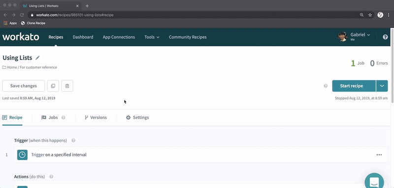

## What this does
A browser bookmarklet that helps you clone a recipe without creating a parent-child relationship.

## Demo

  
Click here to watch a demo

  

## Installing the bookmarklet
See [here](../README.md#installing-the-bookmarklet)
