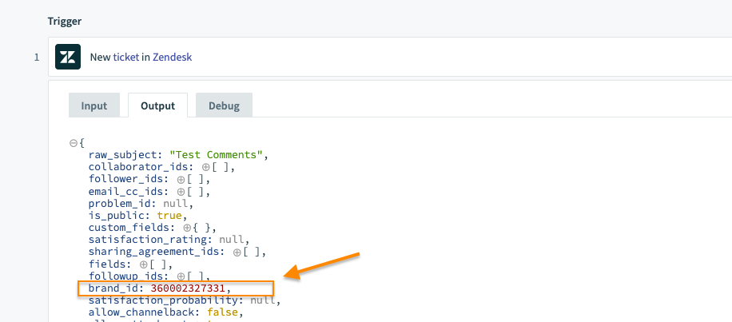
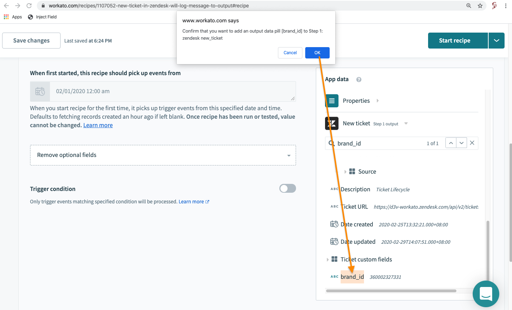
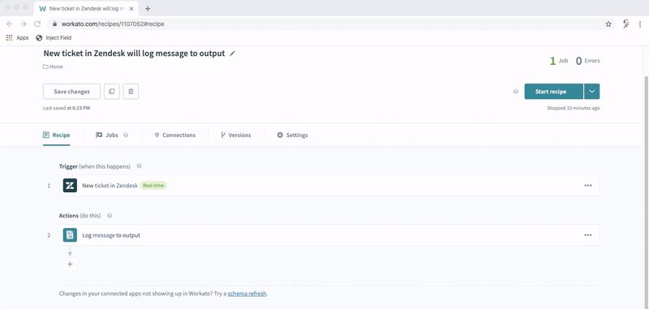

## What this does
A browser bookmarklet that helps you insert a top level data pill into a recipe's trigger/action that is otherwise missing.

If `brand_id` field is missing as a data pill, executing the bookmarklet will create the data pill in the output data tree.

## How it works
The field is appended as a custom schema to the trigger/action.
Note that performing a `Schema refresh` will overwrite the added data pills and the data pills will have to be re-added again.

## Demo

  
Click here to watch a demo

  

## Installing the bookmarklet
See [here](../README.md#installing-the-bookmarklet)