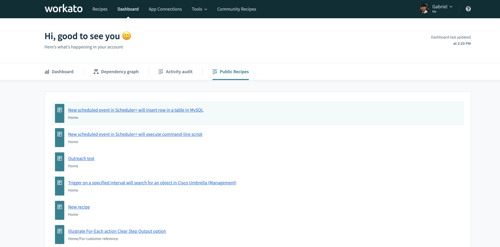
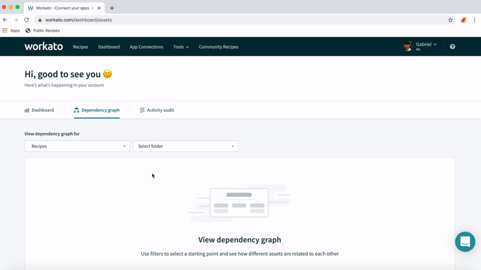

## What this does
A browser bookmarklet that presents to you a report of recipes that are set to "Public" in your account for auditing purposes.

## How it works
On the back end, it automatically checks every recipe in your account and flag public recipes.

On the front end, it creates a new tab in your Workato Dashboard to present that information to you.

## Demo

  
Click here to watch a demo

  

## Installing the bookmarklet
See [here](../#installing-the-bookmarklet)